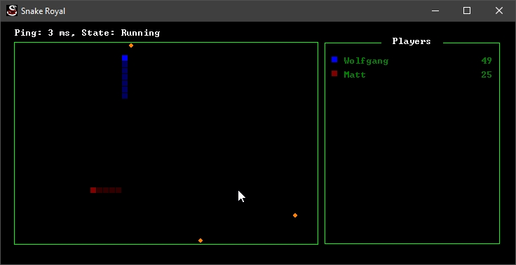

# SnakeRoyal
Multiplayer snake game written at a single weekend


So expect bugs...

# Building
## Windows
Just open it with Visual Studio 2019 Community Edition or higher and it should compile out of the box, it has no dependencies.
## Linux
Sorry but not at this time, PR's are welcome!

# Usage
Once built you can join a server via
```
SnakeRoyal.exe join <ip>
```
The default port is 11754 you can choose to use a different one by adding port
```
SnakeRoyal.exe join <ip>:<port>
```

# Hosting
You can host a server by using following command:
```
SnakeRoyal.exe host
```
If you don't wish to have any visual output you can also choose to do it like following:
```
SnakeRoyal.exe host --headless
```
To specify a different port:
```
SnakeRoyal.exe host <host> <port>
```

# Credits
- Ted John ([IntelOrca](https://github.com/IntelOrca)) for allowing me to use the Socket implementation from [OpenRCT2](https://github.com/OpenRCT2/OpenRCT2)
- Iconby Lorc for the Icon (CC 3.0)
